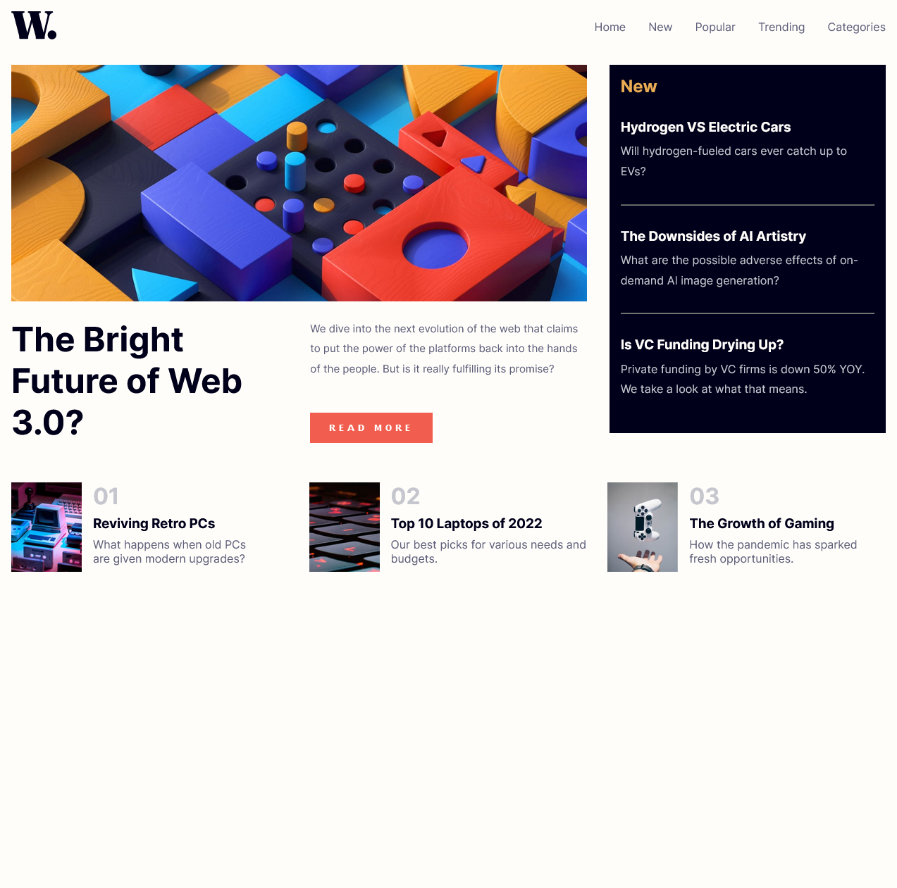
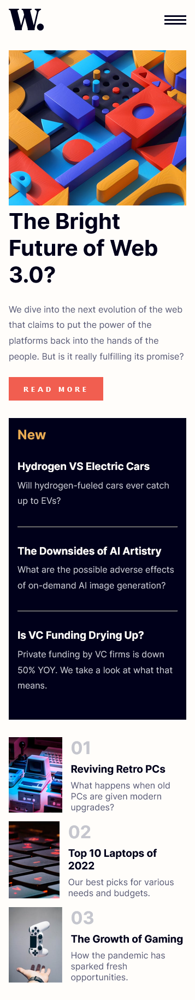
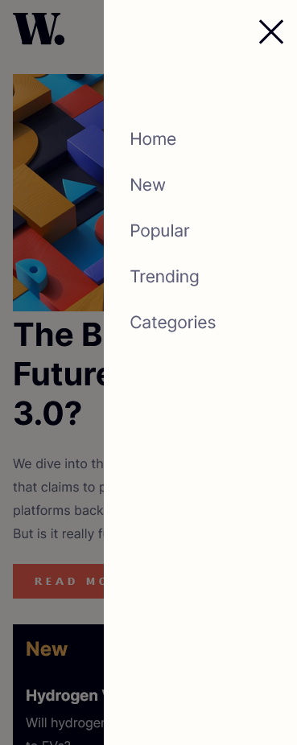

# Frontend Mentor - News homepage solution

This is a solution to the [News homepage challenge on Frontend Mentor](https://www.frontendmentor.io/challenges/news-homepage-H6SWTa1MFl). Frontend Mentor challenges help you improve your coding skills by building realistic projects.

## Table of contents
- [Overview](#overview)
  - [The challenge](#the-challenge)
  - [Screenshots](#screenshot)
- [Built with](#built-with)
- [Useful resources](#useful-resources)

## Overview
The purpose of this project is to build a static web page of a news site using the Astro framework. 

### The challenge

Users should be able to:

- View the optimal layout for the interface depending on their device's screen size
- See hover and focus states for all interactive elements on the page

### Screenshot

### Built with
- HTML
- CSS
- Javascript (Vanilla)
- Mobile-first workflow
- [Astro](https://astro.build/)

### Useful resources

- [Astro Documnetation](https://docs.astro.build/en/getting-started/) - Great documentation to reinforce concepts of the Astro framework